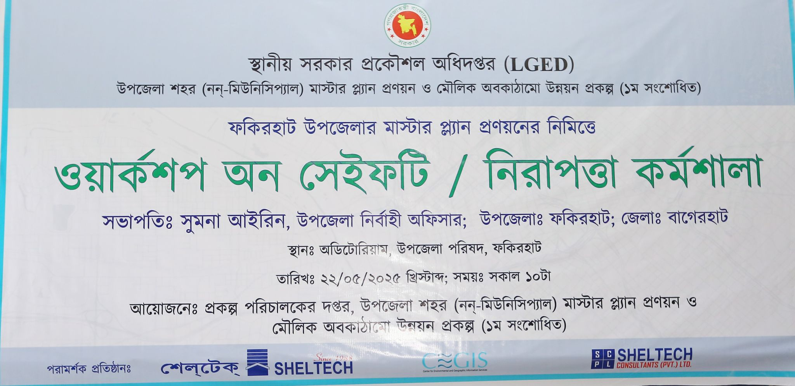
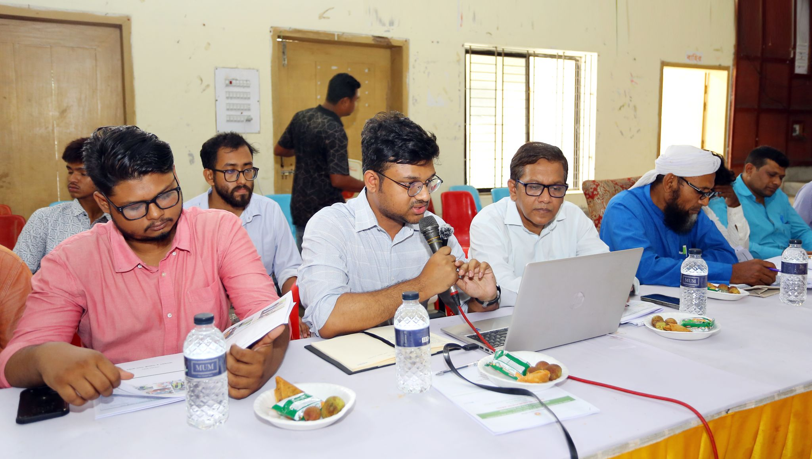
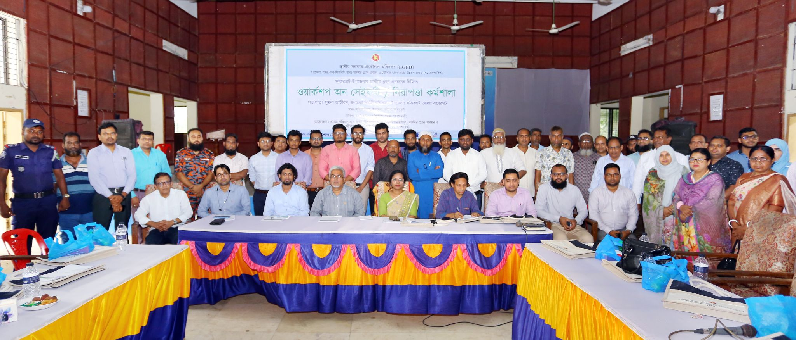

**💼 Designation** - Assistant Urban Planner  

**🏢 Organization** - <a href="https://www.scplbd.com/" target="_blank">Sheltech Consultants (Pvt.) Ltd.</a> 

🗓️ October 2024 – Present

---

**📋Key Reponsibilities**  

▪ Support **urban and regional planning projects** through **field surveys, data analysis, and technical reporting**.  
▪ Assist in **preparing maps and planning documents** using GIS and design tools.  
▪ Collaborate with senior planners, engineers, and local authorities to ensure compliance and inclusivity in planning.  
▪ Contribute to organizing **stakeholder consultations, workshops, and community engagement sessions.**  
▪ Help **drafting master plans, infrastructure proposals, and policy recommendations.**  
▪ Strengthen skills in spatial analysis, research, and multidisciplinary collaboration.  

---

### 👥 Workshop
- **🚦 Promoting Road Safety through Data-Driven Planning & Community Engagement**  

  
  
  

- **Location:** Fakirhat Upazila, Bagerhat District, Bangladesh  
- **Project:** Upazila Town Master Plan & Basic Infrastructure Development  

**Purpose**
- Share findings from recent transport surveys  
- Validate the **core road network** with stakeholders  
- Identify **accident-prone locations (black spots)**  
- Co-design **road safety improvements**

**My Roles:** Organizer & Presenter

**Responsibilities**
- Led workshop design and facilitation; co-presented with **Prof. Dr. Md. Shahid Mamun (Transport Expert)**  
- Supervised field teams during November data collection (10 survey types):**TCS, PCS, OD, PTPS, PIS, Parking, Train Station, Transport Inventory, Speed–Delay, Black-spot mapping**  
- Integrated survey results with community inputs to inform the master plan

**Participants**
- **UNO (Upazila Nirbahi Officer)**, Deputy Team Leader, govt officials, transport operators, and project consultants

