## <i>📝 Project: Exploring the Influence of Potential Factors of Urban Change in Bangladesh. </i>  

- **💡Selected Factors**
 

    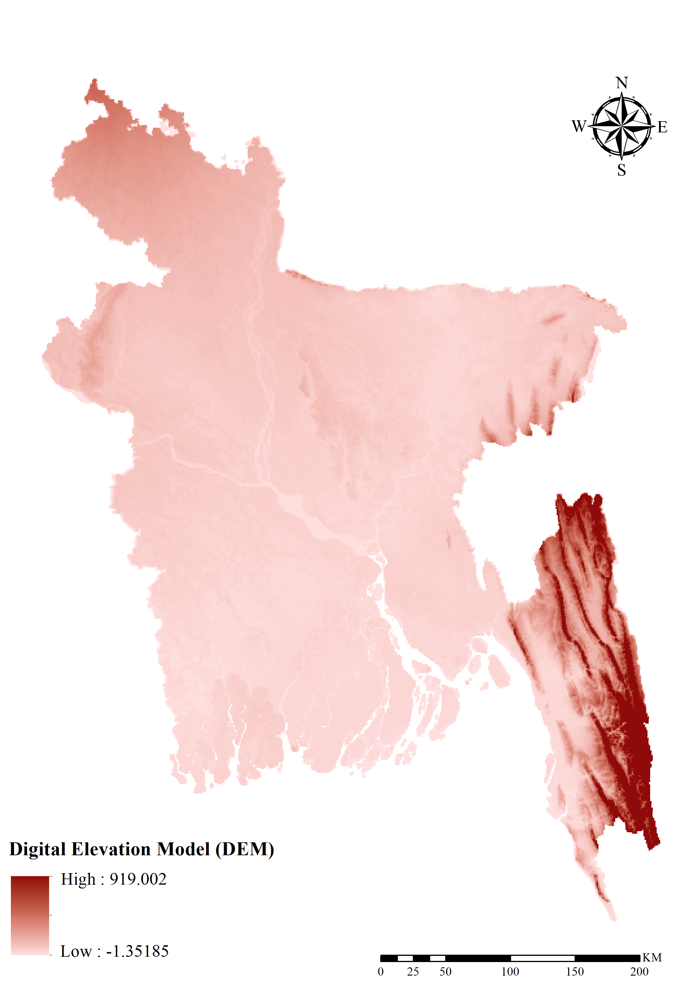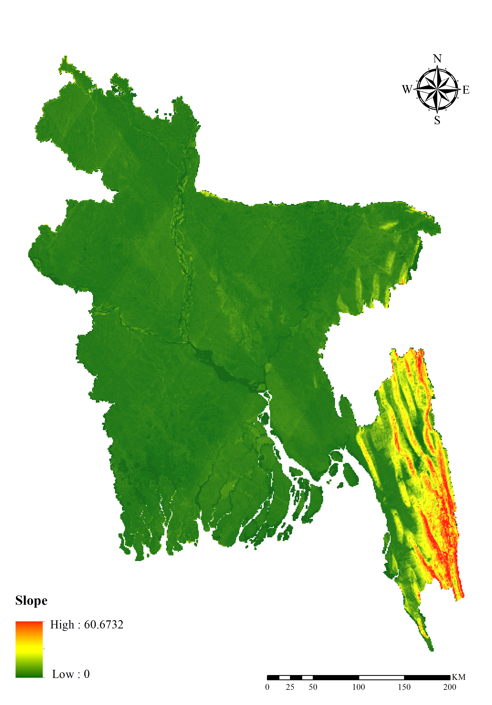
  

 
 

    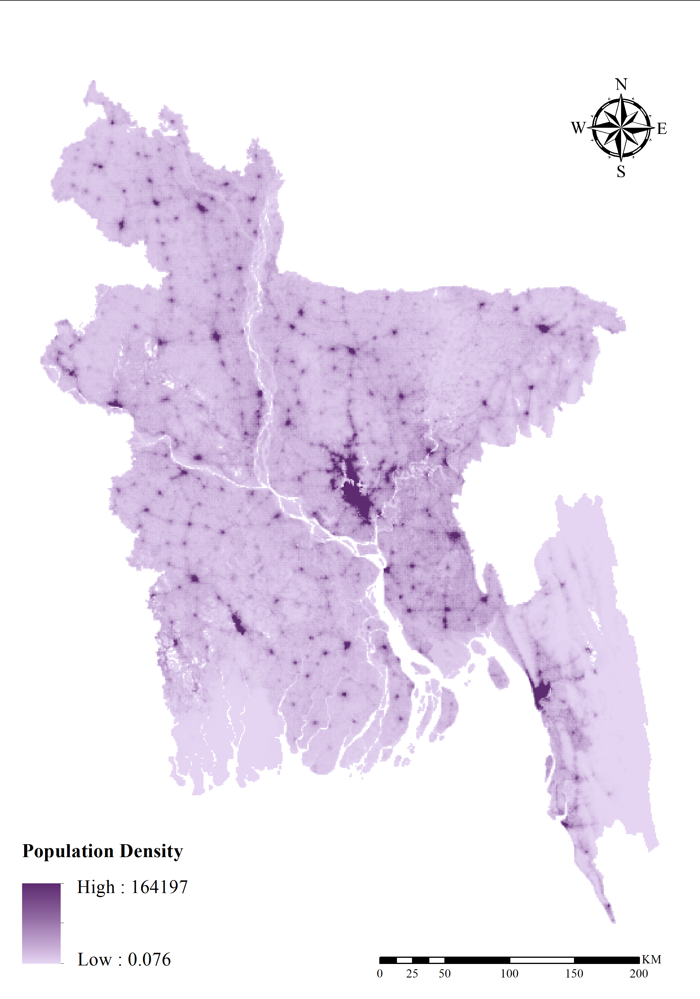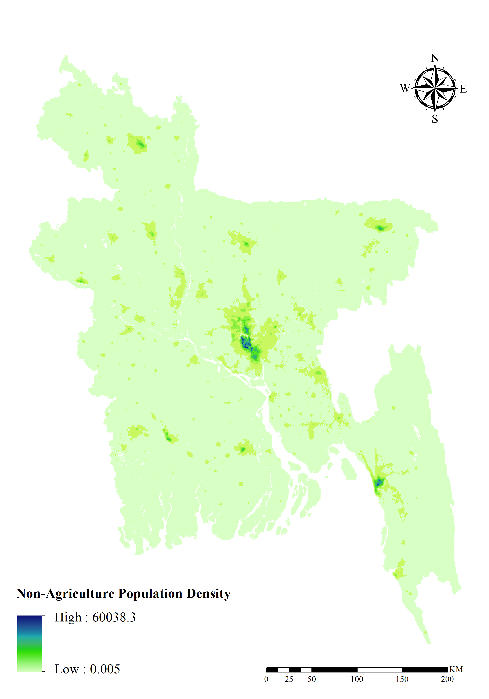
  

  

    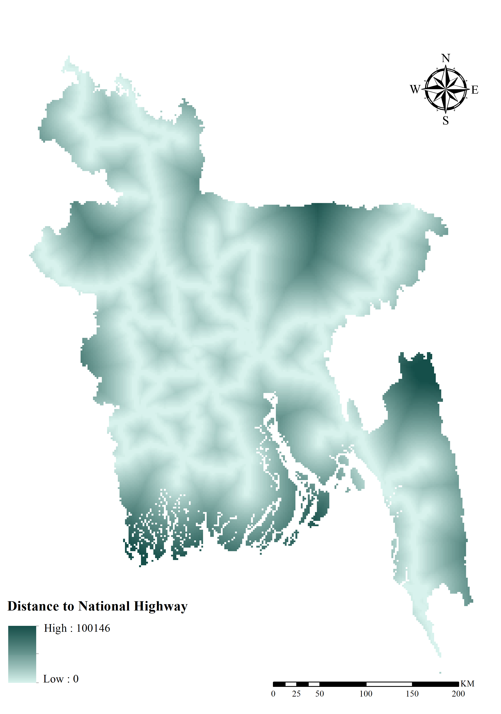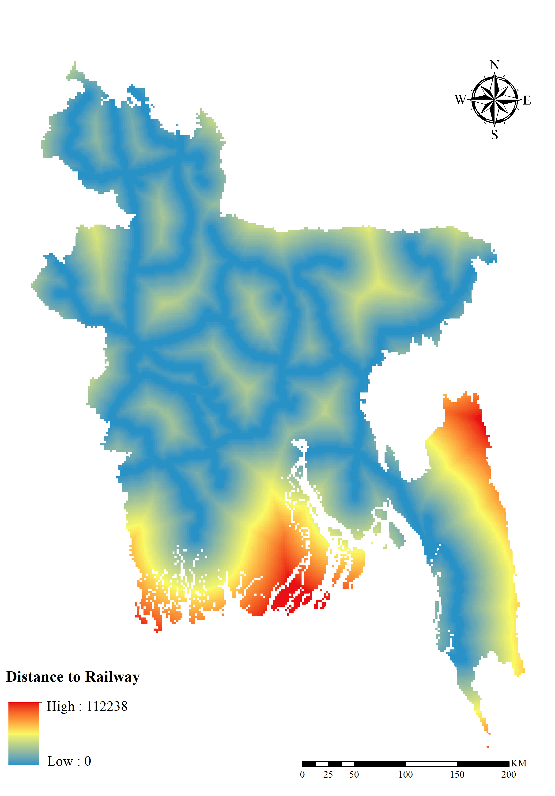
  

  

    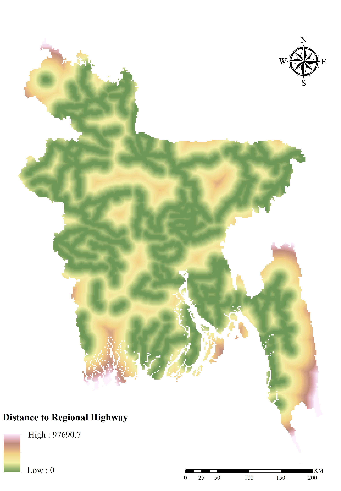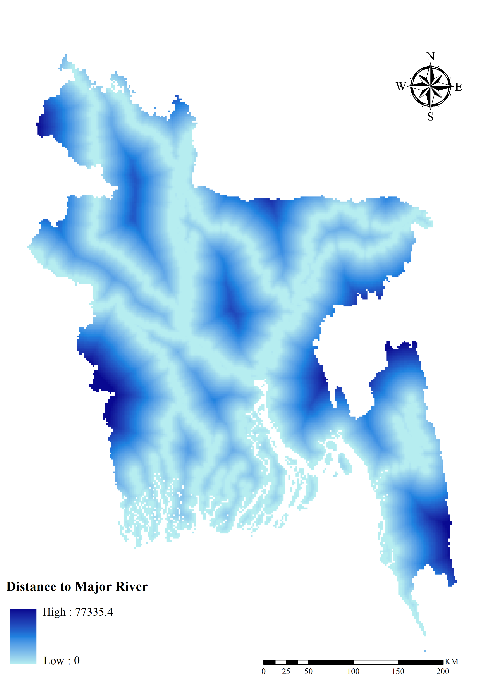
  

  

    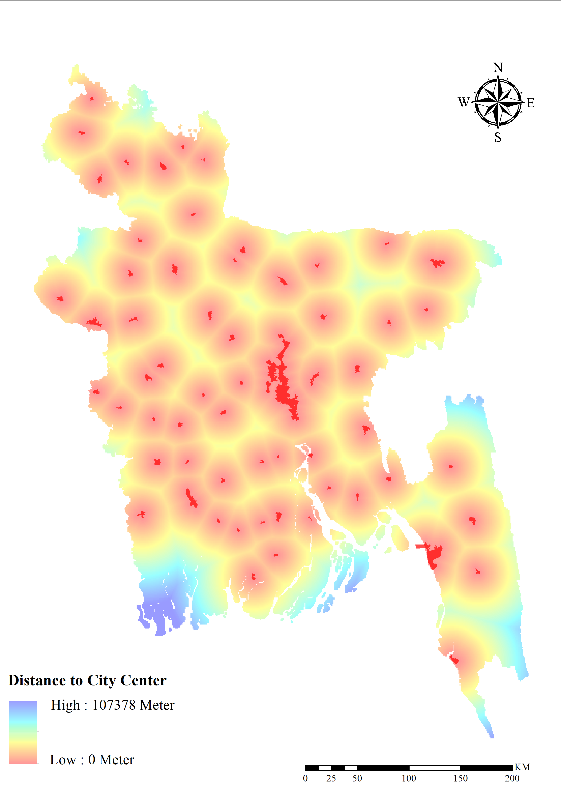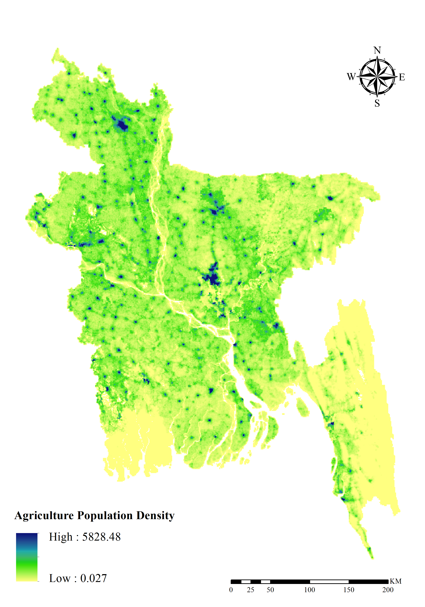
  

- **Sampling Points**

  

    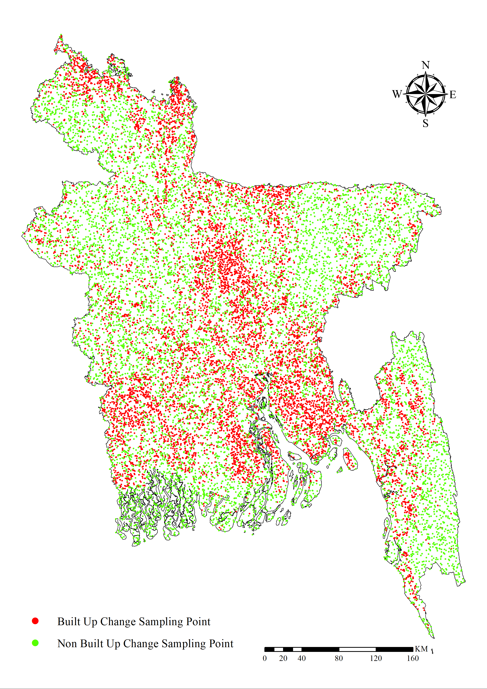
  

- **Urban Density Change**

 

    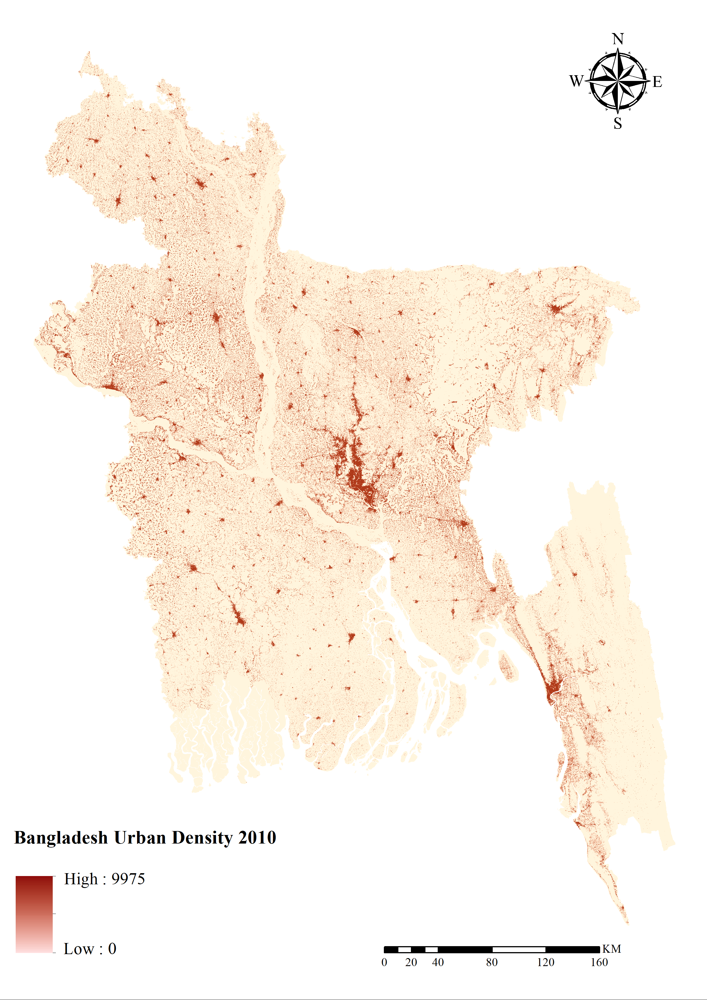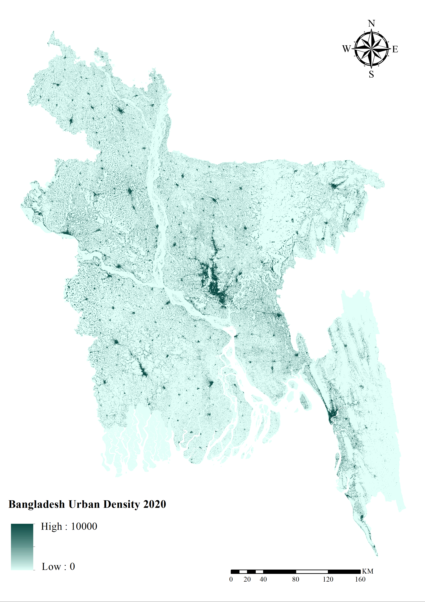
  

 

    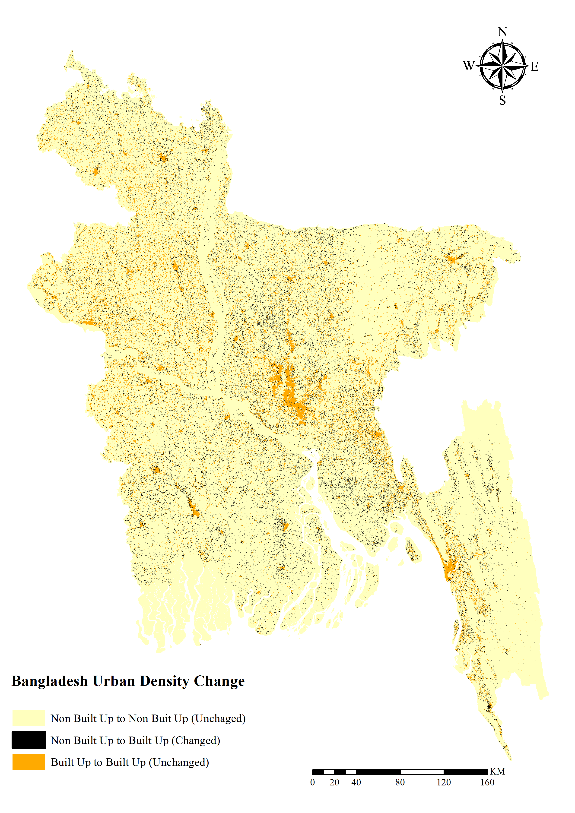
  

- **Model Outcome**

 

    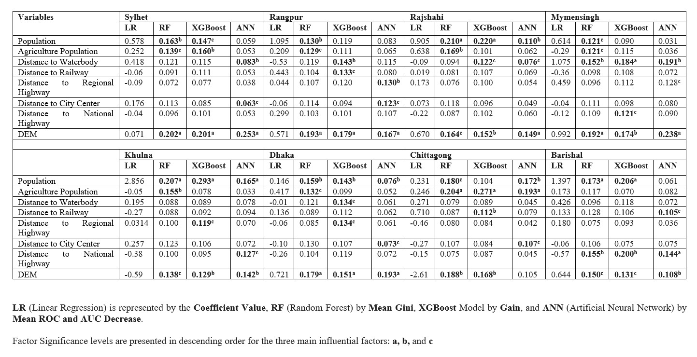
  

